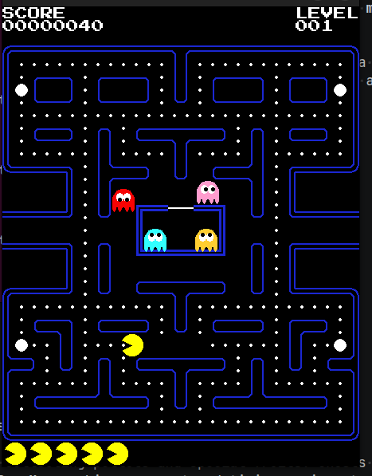

# 🟡 Pac-Man

A custom Python implementation of the classic **Pac-Man** arcade game, built with **Pygame** and inspired by the original Pac-Man gameplay.

This project started as a learning experience following a Pac-Man development tutorial, then evolved into a complete playable game with additional mechanics such as **portals, magic fruits, multiple lives, ghosts, pellets, and level progression**.

The goal was not only to recreate the classic gameplay, but also to understand how a real-time game is structured — from movement and collision detection to game states, enemy behaviour, animations, and level management.

> **Created by [Tchipoque](https://github.com/TCHIPOQUE)**

---

## 🎮 Game Preview

<!-- Add a screenshot of your game here -->
<p align="center">
  
</p>

---

## 🕹️ About the Game

The objective is simple:

**Eat all the pellets, avoid the ghosts, and survive as long as possible.**

Pac-Man navigates through a maze while collecting pellets and special fruits. Ghosts continuously move through the maze and attempt to catch Pac-Man, making movement and timing an important part of the game.

This version also introduces several mechanics that go beyond the basic Pac-Man gameplay.

### ✨ Features

* 🟡 **Pac-Man movement** through a maze
* 👻 **Multiple ghosts** with individual behaviours
* 🟠 **Pellet collection**
* 🍒 **Magic fruits** that provide additional points and special gameplay effects
* 🌀 **Portals** that allow Pac-Man to move from one side of the maze to another
* ❤️ **Five lives** at the beginning of the game
* 💀 Losing a life when caught by a ghost
* 👻 **Frightened ghosts**, allowing Pac-Man to eat them temporarily
* 🏆 **Score system**
* 📈 **Level progression**
* 🎨 Sprite-based animations
* 🔊 Game effects and visual feedback
* 🧩 Grid-based maze and node navigation
* 🎮 Keyboard controls and real-time gameplay

---

## 🍒 Magic Fruits

One of the additional mechanics implemented in this version is the **magic fruit** system.

Fruits appear during gameplay and can be collected by Pac-Man for additional points. Their appearance and behaviour add another objective to the maze besides simply collecting pellets.

The fruit system also helped introduce concepts such as:

* Temporary objects
* Spawn positions
* Timers and lifespans
* Collision detection
* Score management
* Level-dependent behaviour

---

## 🌀 Portals

The maze also contains **portals**, allowing Pac-Man to travel between different areas of the maze.

Portals add another layer to movement and require the game to account for Pac-Man's position while transitioning between different points in the maze.

---

## ❤️ Lives & Game Over

Pac-Man starts the game with **five lives**.

When Pac-Man is caught by a ghost:

1. A life is lost.
2. Pac-Man is reset to his starting position.
3. The game continues if lives remain.
4. When all lives are lost, the game ends.

This required separating the player's **life state** from the normal movement and gameplay logic.

---

## 👻 Ghosts

Ghosts are one of the main challenges of the game.

They navigate the maze independently of Pac-Man and can enter different behavioural states depending on what is happening in the game.

Ghost behaviour involves concepts such as:

* Navigation through the maze
* Target positions
* Direction selection
* Frightened states
* Being eaten by Pac-Man
* Returning to the ghost area
* Respawning and continuing gameplay

This was one of the parts of the project that required the most attention because seemingly simple ghost movement quickly becomes complicated once different game states are introduced.

---

## 🎮 Controls

| Key   | Action     |
| ----- | ---------- |
| `↑`   | Move Up    |
| `↓`   | Move Down  |
| `←`   | Move Left  |
| `→`   | Move Right |
| `ESC` | Quit Game  |

---

## 🚀 Running the Game

### Requirements

You will need:

* Python 3
* Pygame

Install the dependencies with:

```bash
pip install pygame
```

### Clone the repository

```bash
git clone https://github.com/TCHIPOQUE/PacMan.git
cd Pac-Man
```

### Run the game

```bash
make run
```

---

## 🧠 What I Learned

This project was one of my first opportunities to work on a larger interactive Python application.

Beyond learning Pygame itself, I gained experience with several important programming concepts.

### Object-Oriented Programming

The game is divided into different objects representing things such as:

* Pac-Man
* Ghosts
* Pellets
* Fruits
* Nodes
* Sprites
* Game components

This helped me understand how objects can interact with each other while keeping their responsibilities separated.

### Game Loops

A real-time game constantly repeats a cycle:

```text
Input → Update → Collision Detection → Render → Repeat
```

Understanding this loop was essential for making movement, animations, collisions and game states work together.

### Collision Detection

I worked with collisions between:

* Pac-Man and walls
* Pac-Man and pellets
* Pac-Man and fruits
* Pac-Man and ghosts
* Pac-Man and portals

This taught me how small differences in position and timing can significantly affect gameplay.

### Game States

The project also introduced different states for objects and the game itself.

For example, ghosts can change behaviour depending on whether they are:

* Normal
* Frightened
* Eaten
* Returning to their starting area

Managing these states without breaking the rest of the game became an important part of the development process.

### Maze & Node Navigation

The maze is represented as a grid of connected nodes.

This provided a useful introduction to thinking about movement as a **graph/navigation problem**, rather than simply moving an object around the screen.

---

## 🧩 Challenges

One of the biggest challenges was understanding how all the different systems interact.

A change to one mechanic could unexpectedly affect another.

For example, changing ghost behaviour could affect:

* Their movement
* Their target position
* Their current state
* Collision behaviour
* What happens after being eaten

Similarly, implementing additional mechanics such as fruits and portals required integrating them into an already existing game loop without breaking the original gameplay.

Another challenge was moving from following a tutorial to actually understanding **why the code works**.

The tutorial provided a foundation, but debugging and extending the project required reading the existing architecture, tracing how objects communicate, and experimenting with different solutions.

---

## 📚 Inspiration

This project was developed while following and studying the Pac-Man implementation from:

**Pacman Code Tutorial**

The tutorial provided the foundation for understanding the architecture of a Pac-Man game, including concepts such as sprites, nodes, ghosts, movement, collisions and game states.

The project was then adapted and extended while learning how the different systems work together.

---


## 🌱 What Comes Next?

This project also became the foundation for a second version of Pac-Man developed specifically around the **42 School project requirements**.

The 42 version focuses more heavily on adapting the game architecture, procedural maze generation, and implementing additional mechanics under a different set of constraints.

This repository therefore represents the **original learning version**, while the 42 version is maintained separately.

---

## 👨‍💻 Author

**Tchipoque**

---

## ⭐ If you enjoyed the project

Feel free to explore the code, experiment with the game, or use the project as a reference for learning Pygame and game development.
